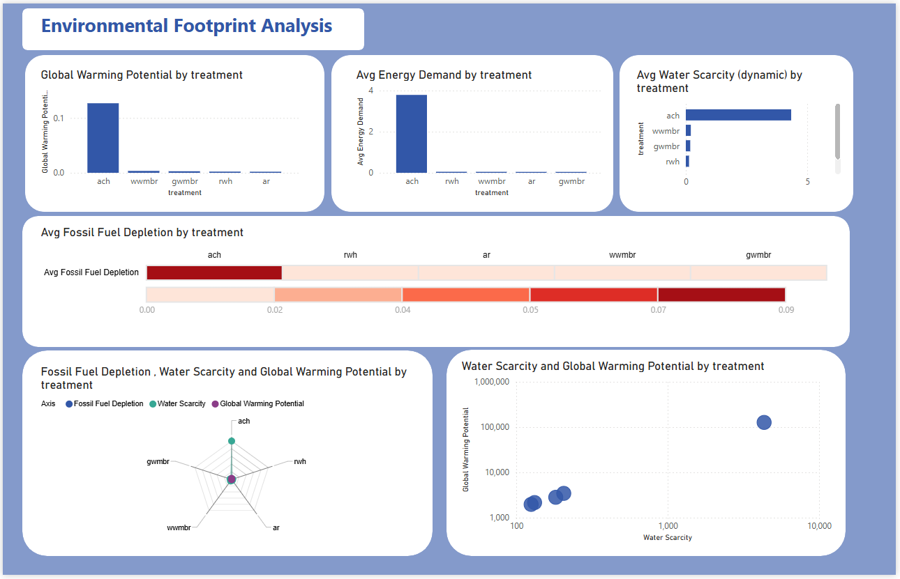
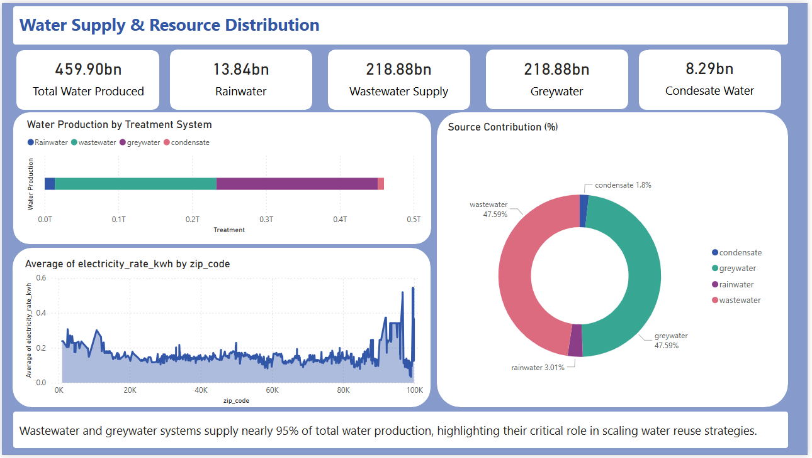

# 🌊 Water Treatment Cost, Risk & Environmental Impact Analysis  
**Python • SQL • Power BI • Data Analytics**

---

## 📌 Project Summary  
This project analyses multiple water treatment systems by comparing **operational cost**, **health risk (DALY)**, **environmental footprint**, and **resource distribution** performance.  
Using Python, SQL, and Power BI, the dataset was cleaned, modelled, validated, and visualised to support evidence-based decision making for sustainable water treatment.

---

## 🎯 Objectives  
- Compare systems based on cost, health risk, and environmental impact  
- Evaluate carbon footprint and sustainability metrics  
- Build dashboards for stakeholder decision-making  
- Validate and structure the dataset using SQL  
- Generate analytical insights from raw treatment data  

---

## 🛠 Tech Stack  
- **Python** (pandas, numpy, matplotlib)  
- **SQL** (data validation & summarisation)  
- **Power BI** (interactive dashboards)  
- **Excel / CSV datasets**  

---

## 📁 Dataset  
**Files Used:**  
- `NEWR_Results_LRTs.xlsx` — Original dataset  
- `NEWR_clean.csv` — Cleaned dataset for analysis  

**Includes:**  
- Cost metrics  
- DALY health risk indicators  
- Energy & chemical usage  
- Carbon emissions  
- Resource distribution values  

---

## 📊 Analysis Components  

### **1️⃣ Python Processing**  
- Cleaned inconsistent values  
- Normalised columns  
- Calculated comparison metrics  
- Generated exploratory plots  

### **2️⃣ SQL Queries**  
- Verified dataset integrity  
- Built summary tables  
- Performed cost/risk calculations  
- Prepared data for dashboards  

### **3️⃣ Power BI Dashboard**  
- Cost comparison visuals  
- Environmental footprint charts  
- Health risk (DALY) metrics  
- Resource distribution insights  

---

## 📸 Visuals  

### **Overview of Treatment Systems**  

### **Environmental Footprint Analysis**  

### **Resource Distribution Map**  

### **Sustainability Dashboard (Power BI)**  

---

## 📈 Key Findings  
- Low-cost systems often show higher DALY risk  
- High-energy methods contribute significantly to carbon emissions  
- Balanced systems perform best across all evaluated metrics  
- Dashboards highlight optimal long-term treatment pathways  
- Supports sustainable and informed decision making  

---

## 📂 File Structure  
├── NEWR_Results_LRTs.xlsx
├── NEWR_clean.csv
├── water_treatment_analysis.ipynb
├── water_treatment_analysis.sql
├── Water Treatment Overview.jpg
├── environmental-footprint-analysis.png
├── Sustainability & Footprint Dashboard.jpg
├── Watersupply-and-resource-distribution.png
└── README.md

---

## 🚀 How to Run  

### **Python Notebook**  
Open the Jupyter Notebook:  
`water_treatment_analysis.ipynb`

### **SQL Script**  
Run the SQL script:  
`water_treatment_analysis.sql`

### **Power BI Dashboard**  
Open the `.pbix` file (if uploaded).

---

## 🧠 Skills Demonstrated  
- Data Cleaning & Transformation  
- Statistical & Environmental Analysis  
- SQL Data Validation  
- Power BI Dashboard Design  
- Research Documentation  
- Operational & Sustainability Evaluation  

---

## 📬 Contact  
**Amy Sauden**  
🔗 LinkedIn: https://www.linkedin.com/in/amishasauden

